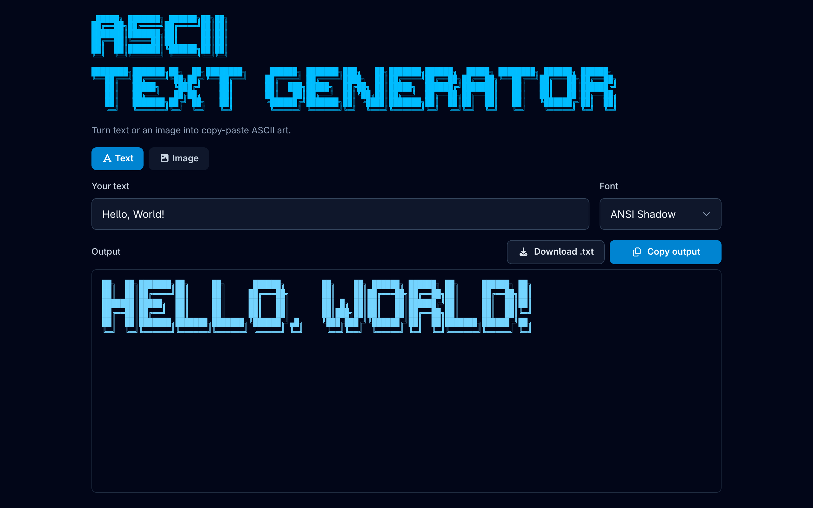

# ASCII Text Generator

Turn text or an image into copy-paste ASCII art, right in the browser. Type a word to render it in a big figlet-style font, or upload a photo (a cat, say) and get an ASCII rendering you can copy or download.

Everything runs client-side. There is no server and nothing is uploaded.



## Features

- **Text to ASCII**: render any text as large ASCII art.
  - Five fonts: a hand-made Block font plus figlet's Standard, Slant, Big, and ANSI Shadow.
  - Adding a font is a drop-in: the render core is a pure `render(text, font)` decoupled from the DOM.
- **Image to ASCII**: upload or drag-and-drop an image and convert it on a `<canvas>`.
  - Adjustable output width (30 to 220 characters).
  - Four character ramps: Standard, Detailed, Blocks, Minimal.
  - Invert toggle for light-on-dark subjects.
- **Copy** to clipboard and **Download** as a `.txt` file, from either panel.
- **Responsive**: fits within `100dvh` with an internally scrolling output; icon-only actions and a compact header on mobile.

## Tech stack

- [Rsbuild](https://rsbuild.rs/) (Rspack) for bundling and dev server
- TypeScript
- [Tailwind CSS v4](https://tailwindcss.com/) via the PostCSS plugin
- [figlet](https://github.com/patorjk/figlet.js) for the text fonts
- [Font Awesome](https://fontawesome.com/) for icons

## Getting started

Prerequisites: Node.js and [pnpm](https://pnpm.io/).

```bash
pnpm install
pnpm dev
```

Then open the URL printed in the terminal (defaults to http://localhost:3000/).

## Scripts

| Script | Description |
| --- | --- |
| `pnpm dev` | Start the Rsbuild dev server |
| `pnpm build` | Build for production |
| `pnpm preview` | Preview the production build locally |
| `pnpm typecheck` | Run `tsc --noEmit` |

## Project structure

```
src/
  ascii/                 core, framework-agnostic
    types.ts             glyph-font types
    typeface.ts          the Typeface interface (name, label, render)
    render.ts            pure glyph-map renderer for the Block font
    image.ts             canvas image-to-ASCII (imageToAscii, loadImage)
    ramps.ts             character-ramp presets for images
    fonts/
      block.ts           hand-made Block glyph font
      figlet.ts          figlet-backed typefaces
      index.ts           typeface registry (drop new fonts in here)
  ui/                    DOM layer
    app.ts               shell: header, tabs, panel mounting
    textPanel.ts         text-to-ASCII panel
    imagePanel.ts        image-to-ASCII panel
    select.ts            reusable native select with custom chevron
    copyButton.ts        reusable copy button
    downloadButton.ts    reusable download-as-.txt button
    clipboard.ts         clipboard helper with fallback
  main.ts                entry point
```

## How it works

- **Text**: each `Typeface` exposes a `render(text)` method. The Block font uses a glyph map (`render.ts`), while the figlet fonts wrap `figlet.textSync`. The UI treats them identically.
- **Image**: the picture is drawn to an offscreen `<canvas>` scaled to the target character grid (aspect-corrected because characters are taller than they are wide). Each cell's luminance (`0.299R + 0.587G + 0.114B`, alpha-weighted) is mapped to a character from the selected ramp, so darker pixels become denser characters.

## License

Licensed under the Apache License 2.0. See [LICENSE](LICENSE).

Copyright 2026 [adam-ctrlc](https://github.com/adam-ctrlc).
